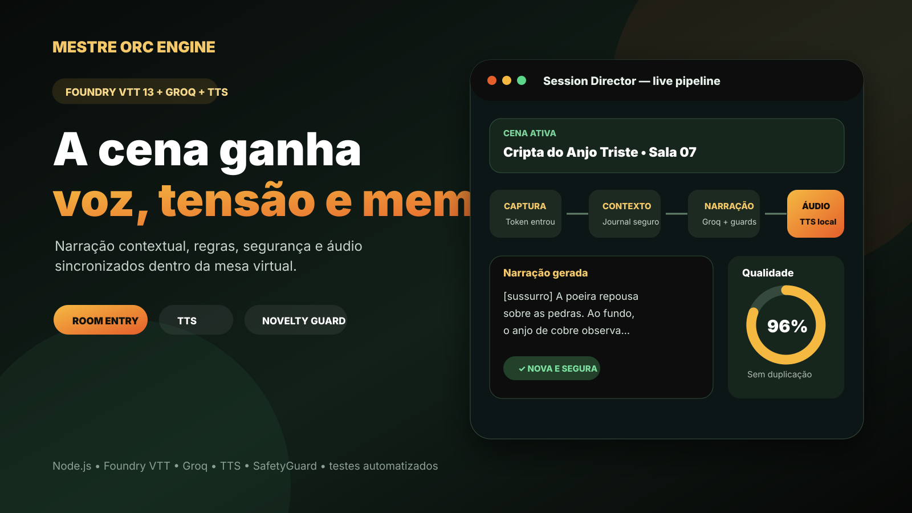

# Mestre Orc / Fênix Engine

Versão base `0.1.0-alpha.24` — Node.js 20–24, Foundry VTT 13 e Fênix VTT standalone.

## Preview



O projeto mantém um Shared Core VTT-agnóstico para contexto, intenção, regras, relacionamentos, narração e áudio. O Foundry VTT continua como adapter de primeira classe, enquanto `apps/fenix-vtt` executa o mesmo Core como cliente standalone com Next.js, WebGL2, contas persistentes e sincronização multiplayer por WebSocket.

## Engine

```powershell
npm ci
Copy-Item .env.example .env
npm run check
npm run dev
```

Configuração mínima de desenvolvimento:

```env
PORT=3001
HOST=0.0.0.0
NODE_ENV=development
CORS_ALLOWED_ORIGINS=http://localhost:30000,http://127.0.0.1:30000,http://localhost:3000,http://localhost:3001
FENIX_STATE_FILE=./data/fenix-state.json
FENIX_AUTH_COOKIE_SAME_SITE=Lax
FENIX_ALLOW_LEGACY_SESSION_HTTP=true
GROQ_API_KEY=sua_chave
GROQ_MODEL=seu_modelo_disponivel
MESTRE_ORC_NARRATION_MEMORY_FILE=./data/narration-history.json
MESTRE_ORC_AUDIO_ENABLED=true
MESTRE_ORC_AUDIO_MODE=browser-tts
```

Abra `http://localhost:3001/health`. Com os serviços ativos, os campos incluem `auth`, `persistence`, `realtime`, `ai` e `audio`.

## Fênix VTT standalone

Em outro terminal:

```powershell
npm run dev:vtt
```

Na primeira abertura, o VTT oferece o **bootstrap único do primeiro Mestre**. Depois disso, a entrada usa login por conta persistente. O GM cria campanhas e gera convites one-time ligados a um `actorId`; o jogador cria/usa sua conta pelo convite e passa a controlar somente aquele personagem.

A identidade do WebSocket não vem mais de `?role=...` ou `?actor=...`. O browser envia somente `sessionId` e `clientId`; o servidor deriva `userId`, papel GM/Player e `actorId` a partir do cookie HttpOnly e da membership da campanha.

O fluxo standalone atual possui:

- Next.js 15 + React 19 + Tailwind CSS 4;
- renderer WebGL2 atrás de `MapRendererPort`;
- autenticação com senha derivada por `scrypt`;
- sessão por token opaco, persistindo somente seu hash;
- campanhas, memberships e convites expirantes de uso único;
- `RealtimeSessionHub` com cena/tokens/sala/histórico persistíveis;
- WebSocket `/v1/realtime` com autoridade GM/Player no servidor;
- `ROOM_ENTERED` produzido pelo movimento e narrado pelo Shared Core;
- broadcast de narração e áudio;
- restauração da mesma sessão após restart, sem repetir a abertura da cena.

A persistência atual usa `FENIX_STATE_FILE`. É um adapter **single-instance alpha**; em Render, use Persistent Disk. O próximo adapter previsto é PostgreSQL para múltiplas instâncias/campanhas concorrentes. Consulte `docs/FENIX_AUTH_PERSISTENCE.md`.

## Comandos

- `npm run dev`: inicia API/Engine.
- `npm run dev:vtt`: inicia o Fênix VTT.
- `npm run build:vtt`: gera o build standalone do Next.js.
- `npm test`: executa a suíte `node:test`.
- `npm run test:auth-integration`: valida cookies, contas, campanhas e convites no Fastify real.
- `npm run test:realtime-integration`: valida o adapter WebSocket real.
- `npm run validate`: valida fronteiras, arquivos e versões.
- `npm run check`: executa validação + testes do Core.

## Segurança e operação

- Nunca versione `.env`, `data/fenix-state.json`, `data/narration-history.json` ou `node_modules`.
- Senhas usam `scrypt` + salt aleatório; tokens reutilizáveis de sessão/convite não são gravados em texto puro.
- Cookies de autenticação são `HttpOnly`; em produção são `Secure` e usam `SameSite=None` por padrão para frontend/API cross-site.
- O upgrade WebSocket valida `Origin`, limita payload e aplica rate limit por peer.
- Jogador não pode escolher `role`/`actorId` pela URL, mover outro token, trocar cena ou encerrar a sessão.
- Em produção, o HTTP legado de sessão fica fechado por padrão. Ative `FENIX_ALLOW_LEGACY_SESSION_HTTP=true` apenas quando o adapter Foundry precisar dessa compatibilidade.
- O arquivo persistente é escrito atomicamente, mas não substitui um banco transacional para horizontal scaling.

## Módulo Foundry

Copie `apps/foundry-module` para:

```text
FoundryVTT/Data/modules/mestre-orc/
```

A lógica alpha.24 continua no módulo: número de sala, Journal relacionado, read-aloud seguro, narração privada/áudio e captura de ações. A compatibilidade HTTP legado existe para que essa integração não precise migrar no mesmo marco do VTT standalone.

## Arquitetura validada

```text
Foundry VTT --------------------------┐
                                     ├→ VTT Contracts → Shared Core → NarrationOutput
Conta → Campaign Membership → VTT ---┘                       │
               │                                             ├→ texto
               ↓                                             └→ áudio
       RealtimeSessionGateway                                     ↓
               ↓                                            todos os peers
       RealtimeSessionHub
        │       │       │
      Scene   Tokens   Rooms
        └───────┼───────┘
                ↓
       Persistence Repository
```

`SessionDirector` continua sem conhecer Foundry, autenticação, banco, Fastify, WebSocket, React ou WebGL.

## CI

A pipeline exige:

1. validação + `node:test` em Node.js 20, 22 e 24;
2. testes de token/convite/anti-escalation/restart;
3. lockfile portátil + `npm ci` público;
4. integração HTTP real de autenticação/campanha;
5. integração WebSocket real;
6. build de produção do Fênix VTT.

Os arquivos `README-ALPHA*.md` preservam o histórico das versões anteriores.
